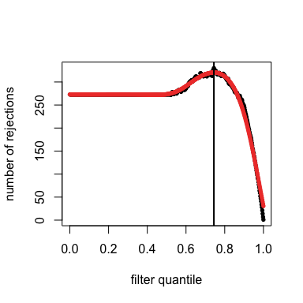
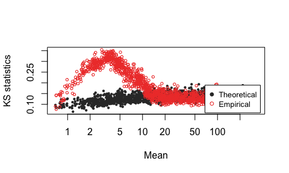
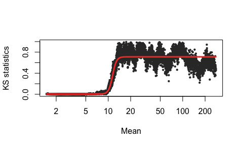

DEBRA demo
================
Yevhen Akimov
7/9/2019

DEBRA - DESeq-based Barcode Representation Analysis
===================================================

Install package
---------------

``` r
library(devtools)
install_github("YevhenAkimov/DEBRA")
```

Let's attach the DEBRA library and load example dataset
-------------------------------------------------------

``` r
library(DEBRA)
```

    ## Loading required package: locfit

    ## locfit 1.5-9.1    2013-03-22

``` r
data(bar_counts)
head(bar_counts)
```

    ##                                           null_660.1 null_660.2 null_330.1
    ## AAAAACAGACGCGTATGGGGCGGTCTAGCCCAATGAATGGA          0          3         13
    ## AAAACATGATCTCCGAGCGATGGCCAATGATAAAGGGAGGA          3          5          0
    ## AAAACATGATTGGAGAAGAATGGTCCGTTCTGTAGAATGGT         87        119        110
    ## AAAATGGCCCGTCCCCGAGACGGCCACAGAAGTCGAGAGGT          2          6          6
    ## AAACAGTAAGTGAATAGAGAAGGACCTCGGTGATCAGCGGA          6          4          5
    ## AAACCCTTAGGATCATTGGGGGGATGACGATTCAGGAAGGC        485        501        445
    ##                                           null_330.2 m_null_40.p35.1
    ## AAAAACAGACGCGTATGGGGCGGTCTAGCCCAATGAATGGA          1               2
    ## AAAACATGATCTCCGAGCGATGGCCAATGATAAAGGGAGGA          0               0
    ## AAAACATGATTGGAGAAGAATGGTCCGTTCTGTAGAATGGT         96              63
    ## AAAATGGCCCGTCCCCGAGACGGCCACAGAAGTCGAGAGGT          0               0
    ## AAACAGTAAGTGAATAGAGAAGGACCTCGGTGATCAGCGGA          5               0
    ## AAACCCTTAGGATCATTGGGGGGATGACGATTCAGGAAGGC        462             319
    ##                                           m_null_40.p35.2
    ## AAAAACAGACGCGTATGGGGCGGTCTAGCCCAATGAATGGA               0
    ## AAAACATGATCTCCGAGCGATGGCCAATGATAAAGGGAGGA               4
    ## AAAACATGATTGGAGAAGAATGGTCCGTTCTGTAGAATGGT              65
    ## AAAATGGCCCGTCCCCGAGACGGCCACAGAAGTCGAGAGGT               0
    ## AAACAGTAAGTGAATAGAGAAGGACCTCGGTGATCAGCGGA               4
    ## AAACCCTTAGGATCATTGGGGGGATGACGATTCAGGAAGGC             293

**Define control and condition sample names and run DEBRA script**
------------------------------------------------------------------

``` r
control_names = c("null_660.1","null_660.2","null_330.1","null_330.2" )
condition_names = c("m_null_40.p35.1","m_null_40.p35.2")

drb=DEBRA(bar_counts, control_names, condition_names, method="DESeq2(Wald)")
```

    ## [1] KS tests completed
    ## [1] "Overlap estimation completed"

**Extracting results**
----------------------

Sorted results

``` r
results=resultsDRB(drb)
head(results)
```

    ##                                            baseMean log2FoldChange
    ## TGTGACACCTTATTCCGGGGAGGCAACATTCAAGGGGCGGA 3013.6896     -0.6348834
    ## CGTTACTCGGGGGATTCCGGGGGACATGCGTGAGGCGTGGA  970.3050     -0.7324366
    ## TTGCACACGATATCGCAAGGAGGAATTTGTTGTTGGGAGGT  950.7817      0.7207876
    ## CCTGGGCTCGGCGTCTGAGATGGTAAGTGATTCCAGGTGGC 1614.1302     -0.6200769
    ## ATTGTCGGCAGGAAGAAGCGTGGTGCCTGCCTTGGGAGGGT 1186.2894     -0.6587834
    ## TCTTTTTCGCGAAAGTAGGGCGGTGAACACTTTCCAGAGGC  199.3760     -1.4956945
    ##                                               lfcSE      stat       pvalue
    ## TGTGACACCTTATTCCGGGGAGGCAACATTCAAGGGGCGGA 0.1108983 -5.724918 1.034837e-08
    ## CGTTACTCGGGGGATTCCGGGGGACATGCGTGAGGCGTGGA 0.1425014 -5.139854 2.749521e-07
    ## TTGCACACGATATCGCAAGGAGGAATTTGTTGTTGGGAGGT 0.1402106  5.140750 2.736445e-07
    ## CCTGGGCTCGGCGTCTGAGATGGTAAGTGATTCCAGGTGGC 0.1232661 -5.030393 4.894754e-07
    ## ATTGTCGGCAGGAAGAAGCGTGGTGCCTGCCTTGGGAGGGT 0.1335535 -4.932731 8.108773e-07
    ## TCTTTTTCGCGAAAGTAGGGCGGTGAACACTTTCCAGAGGC 0.3018721 -4.954729 7.243127e-07
    ##                                                   padj
    ## TGTGACACCTTATTCCGGGGAGGCAACATTCAAGGGGCGGA 9.127260e-06
    ## CGTTACTCGGGGGATTCCGGGGGACATGCGTGAGGCGTGGA 8.083591e-05
    ## TTGCACACGATATCGCAAGGAGGAATTTGTTGTTGGGAGGT 8.083591e-05
    ## CCTGGGCTCGGCGTCTGAGATGGTAAGTGATTCCAGGTGGC 1.079293e-04
    ## ATTGTCGGCAGGAAGAAGCGTGGTGCCTGCCTTGGGAGGGT 1.191990e-04
    ## TCTTTTTCGCGAAAGTAGGGCGGTGAACACTTTCCAGAGGC 1.191990e-04

Sorted results with no independent filtering applied

``` r
results=resultsDRB(drb,filtered=F)
head(results)
```

    ##                                            baseMean log2FoldChange
    ## TGTGACACCTTATTCCGGGGAGGCAACATTCAAGGGGCGGA 3013.6896     -0.6348834
    ## CGTTACTCGGGGGATTCCGGGGGACATGCGTGAGGCGTGGA  970.3050     -0.7324366
    ## TTGCACACGATATCGCAAGGAGGAATTTGTTGTTGGGAGGT  950.7817      0.7207876
    ## CCTGGGCTCGGCGTCTGAGATGGTAAGTGATTCCAGGTGGC 1614.1302     -0.6200769
    ## ATTGTCGGCAGGAAGAAGCGTGGTGCCTGCCTTGGGAGGGT 1186.2894     -0.6587834
    ## TCTTTTTCGCGAAAGTAGGGCGGTGAACACTTTCCAGAGGC  199.3760     -1.4956945
    ##                                               lfcSE      stat       pvalue
    ## TGTGACACCTTATTCCGGGGAGGCAACATTCAAGGGGCGGA 0.1108983 -5.724918 1.034837e-08
    ## CGTTACTCGGGGGATTCCGGGGGACATGCGTGAGGCGTGGA 0.1425014 -5.139854 2.749521e-07
    ## TTGCACACGATATCGCAAGGAGGAATTTGTTGTTGGGAGGT 0.1402106  5.140750 2.736445e-07
    ## CCTGGGCTCGGCGTCTGAGATGGTAAGTGATTCCAGGTGGC 0.1232661 -5.030393 4.894754e-07
    ## ATTGTCGGCAGGAAGAAGCGTGGTGCCTGCCTTGGGAGGGT 0.1335535 -4.932731 8.108773e-07
    ## TCTTTTTCGCGAAAGTAGGGCGGTGAACACTTTCCAGAGGC 0.3018721 -4.954729 7.243127e-07
    ##                                                   padj
    ## TGTGACACCTTATTCCGGGGAGGCAACATTCAAGGGGCGGA 3.511201e-05
    ## CGTTACTCGGGGGATTCCGGGGGACATGCGTGAGGCGTGGA 3.109708e-04
    ## TTGCACACGATATCGCAAGGAGGAATTTGTTGTTGGGAGGT 3.109708e-04
    ## CCTGGGCTCGGCGTCTGAGATGGTAAGTGATTCCAGGTGGC 4.151975e-04
    ## ATTGTCGGCAGGAAGAAGCGTGGTGCCTGCCTTGGGAGGGT 4.585511e-04
    ## TCTTTTTCGCGAAAGTAGGGCGGTGAACACTTTCCAGAGGC 4.585511e-04

**Now we can display analytical plots**
---------------------------------------

MA-plot

``` r
MAplot(drb)
```


``` r
MAplot(drb,FDR=0.1)
```


MA-plot for non-filtered data

``` r
MAplot(drb, filtered =F)
```


Visualize independet filtering results

``` r
filterPlot(drb)
```



**Visualized data related to beta threshold estimation**
--------------------------------------------------------

Plot theoretical and empirical Kolmogorov-Smirnov (KS) statistic values

``` r
KS_plot(drb)
```



Plot local overlap between Gamma-modelled empirical and theoretical Kolmogorov-Smirnov statistic values

``` r
overlapFit(drb)
```


